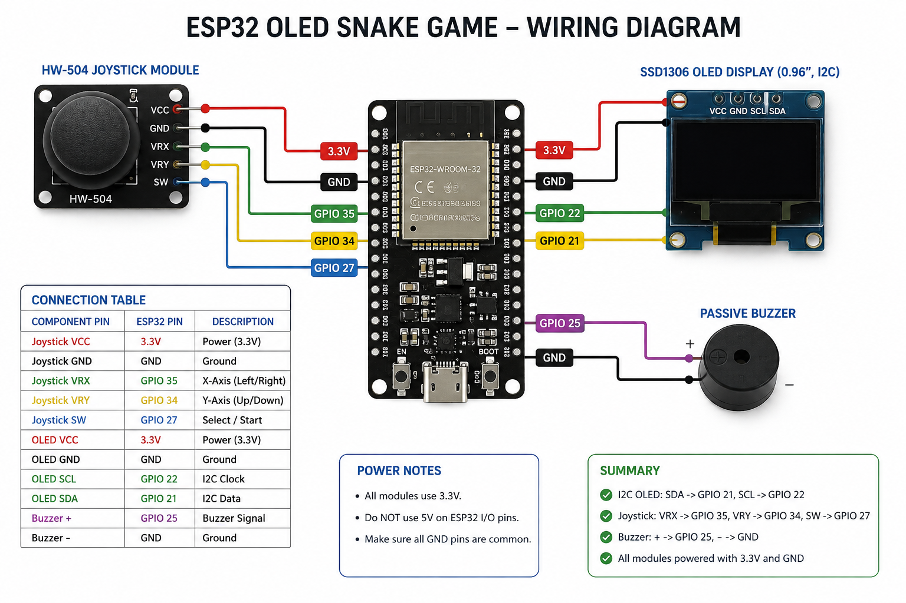

# ESP32 OLED Snake

A simple Snake game built with an ESP32, SSD1306 OLED display, HW-504 joystick and a passive buzzer.

The project runs entirely on the ESP32 and provides joystick control, score tracking, increasing game speed, sound effects and a game-over screen.


## Features

- Snake game on a 0.96" SSD1306 OLED
- HW-504 joystick control
- Joystick button for restarting the game
- Passive buzzer sound effects
- Score counter
- Random food generation
- Snake grows when food is eaten
- Increasing game speed
- Screen wrapping
- Game-over detection
- Joystick center calibration at startup

## Components

- ESP32
- 0.96" SSD1306 OLED (I2C)
- HW-504 Joystick Module
- Passive Buzzer
- Breadboard
- Jumper wires

## Wiring



### OLED

| OLED Pin | ESP32 |
|----------|-------|
| VCC | 3.3V |
| GND | GND |
| SDA | GPIO 21 |
| SCL | GPIO 22 |

### HW-504 Joystick

| Joystick Pin | ESP32 |
|--------------|-------|
| 5V | 3.3V |
| GND | GND |
| VRX | GPIO 35 |
| VRY | GPIO 34 |
| SW | GPIO 27 |

> The joystick module is powered from 3.3V so that its analog outputs remain within the ESP32 input voltage range.

### Passive Buzzer

| Buzzer | ESP32 |
|--------|-------|
| + | GPIO 25 |
| - | GND |

## Libraries

- [U8g2](https://github.com/olikraus/u8g2)
- Wire library (included with the Arduino ESP32 core)

## Controls

| Joystick | Action |
|----------|--------|
| Up | Move up |
| Down | Move down |
| Left | Move left |
| Right | Move right |
| Press | Restart game |

## Sound Effects

The passive buzzer produces different sounds for:

- Game startup
- Eating food
- Game over

## How to Run

1. Connect the components according to the wiring diagram.
2. Install the U8g2 library in Arduino IDE.
3. Open `SnakeCode.ino`.
4. Select your ESP32 board.
5. Select the correct COM port.
6. Upload the code.
7. Play Snake.

## Project Structure

```text
ESP32-OLED-Snake/
├── SnakeCode.ino
├── wiring.png
├── snake-demo.gif
└── README.md
